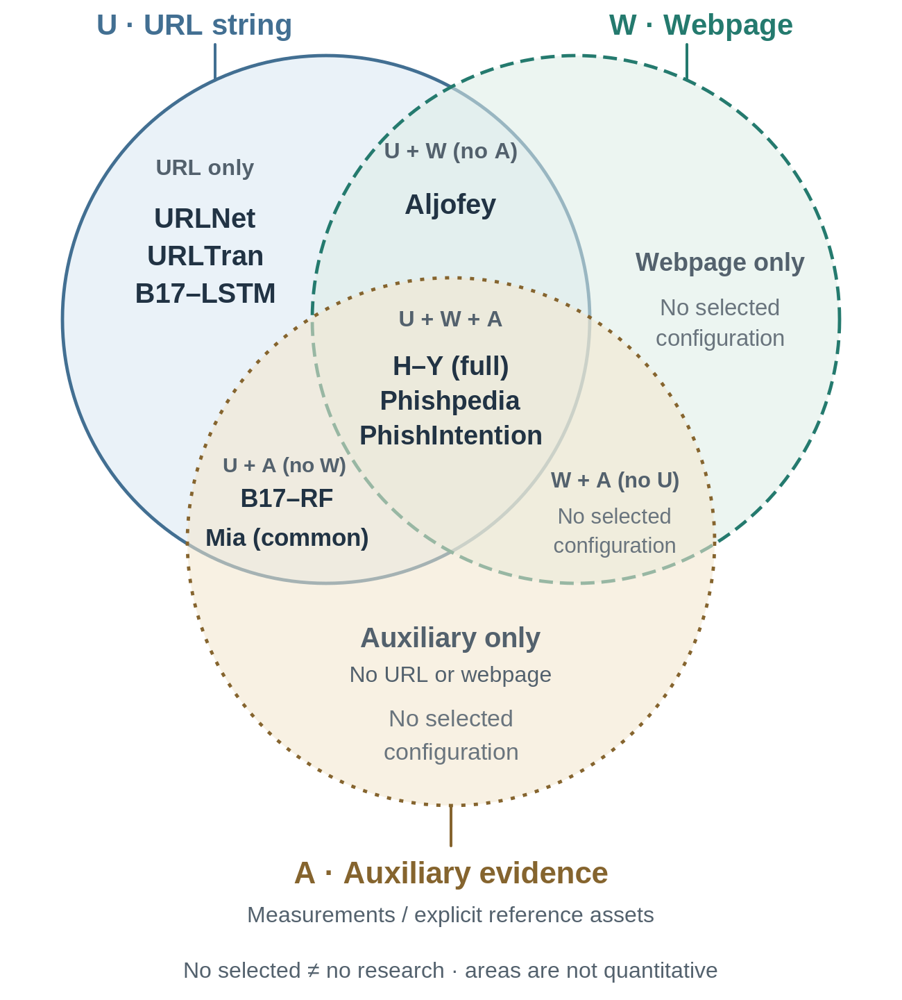

# Comparative Analysis of Phishing Detection
## Interpretable analysis of non-detection on AI-generated phishing-like URLs

Table of content:
1. [Comparison framework](#1-comparison-framework)
2. [Detection: representation versus information access](#2-detection-representation-versus-information-access)
3. [Generation and robustness: compare the intervention and error](#3-generation-and-robustness-compare-the-intervention-and-error)
4. [Diagnosis: from attribution to confirmed groups](#4-diagnosis-from-attribution-to-confirmed-groups)
5. [Representative approaches: evidence and boundaries](#5-representative-approaches-evidence-and-boundaries)
6. [Information overlap and project implications](#6-information-overlap-and-project-implications)
7. [References](#7-references)

## 1. Comparison framework
We compare the hierarchy’s overlapping research roles: detection (D1–D2), generation for evaluation or training (S1–S2), and distribution shift, stress testing and diagnosis (E1–E3). The questions are what a method observes, how it processes that evidence, what its experiment establishes, and what remains unresolved. Table 1 and Figure 1 support this comparison; they are not a cross-paper accuracy ranking. A learned representation changes the encoding of information, whereas an extra information source changes what the system can observe.

## 2. Detection: representation versus information access
Hannousse–Yahiouche [1] compare 87 URL, content and external-service features on 11,430 balanced observations, including extraction cost. Bahnsen et al. [2] compare a character-level long short-term memory network (LSTM) with an engineered-feature random forest (RF) that also uses an Alexa-list indicator. Named inputs aid inspection, but do not make every decision transparent. URLNet [3] combines character- and word-level convolutional representations; its timestamp-ordered evaluation concerns malicious URLs more broadly than phishing. URLTran [4] uses transformers: in its own benchmark, true-positive rate is 86.80% versus 71.20% for its URLNet baseline at 0.01% false-positive rate. This matched comparison does not establish a universal ranking or supply missing webpage evidence.

Aljofey et al. [5] combine URL encoding, HTML text-fragment weights (TF–IDF), and hyperlink/login features using XGBoost (boosted decision trees). They avoid third-party service features, not HTML acquisition; separate within-dataset tests are not cross-dataset transfer. Phishpedia [6] instead checks logo/brand and domain consistency. PhishIntention [7] adds credential-taking evidence and interaction. Its two-month field study reports 139 versus 1,033 false alerts, but also 1,942 versus 2,071 confirmed detections. Those counts do not establish deployment recall. Richer evidence addresses ambiguities that bare generated strings cannot resolve, while adding acquisition and reference dependencies.

## 3. Generation and robustness: compare the intervention and error
DeepPhish [8] evaluates actor-associated LSTM-generated URLs against an existing detector and already analyzes structures and strategies. Its two reported non-blocked proportions increase from 0.69% to 20.90% and from 4.91% to 36.28%; these are experiment-specific, not credential-theft rates. Pham et al. [9] (Section 4.3) instead retrain RF/LSTM classifiers with augmented data and test on a common set. PhishHaven [10] already compares conventional and generated characteristics; its URL-expansion stage makes the full pipeline more than supplied-string processing.

Rashid et al. [11] connect cross-source errors, feature differences and unsupervised adaptation, which permits unlabeled target information rather than an untouched target. URLTran [4] also studies controlled transformations and augmented training. Ahamed et al. [13] use rule-based mutations, not learned generation; explanation-stability analysis is logistic-regression-only, and some accuracy losses are false-positive cascades rather than more missed phishing. PhreshPhish v2 [12] supplies temporal information, similarity controls and prevalence-aware benchmarks. These and Arp et al.’s guidance [16] make splits, sampling and information access central to interpretation.

## 4. Diagnosis: from attribution to confirmed groups
Mia et al. [14] use XGBoost and SHAP feature attributions on 20 common features across datasets; indexing and redirects mean this is not lexical-only. Attribution describes prediction contributions, not causation or a subgroup’s non-detection rate [17]. DivExplorer [15] mines frequent property combinations and outcome-rate divergence; support and discretization restrict the search. Ablation measures input-group utility, brand identification names an apparent target, and subgroup characterization describes covered observations and their outcome rates. Our proposed adaptation must define how overlapping rules yield a single diagnostic function $g$; no stable association or accuracy improvement is assumed.

## 5. Representative approaches: evidence and boundaries
Table 1. Configuration-specific comparison. D1: URL string; D2: additional evidence; S1/S2: generated data for evaluation/training; E1: shift/adaptation; E2: controlled stress tests; E3: diagnosis. LR: logistic regression; CNN: convolutional neural network; GAN: generative adversarial network. Rows are not a performance ranking.

| Study / role | Inputs and mechanism | Evaluation / contribution | Limitation or scope boundary |
|---|---|---|---|
| **Hannousse–Yahiouche [1] · D2** | Engineered URL, content and external-service features; conventional classifiers. | Ten-fold evaluation and extraction timing show information/cost trade-offs. | Within-collection evidence, not external reliability; feature count is not acquisition cost. |
| **Bahnsen [2] · D1/D2** | URL characters → LSTM; engineered features plus Alexa indicator → RF. | Recorded-URL, training-size and resource comparisons; RF importance reported. | Variants differ in reference access as well as representation; importance is not error characterization. |
| **URLNet [3] · D1** | Character/word CNN branches, including subword character information. | Timestamp-ordered VirusTotal data: 5M training / 10M test URLs; supports unfamiliar word strings. | Maliciousness is broader than phishing; vocabulary handling is not generated-input robustness. |
| **URLTran [4] · D1/E2/S2** | Transformer URL model; specified mutations and extra training. | Production week-based splits; matched low-FPR comparison; controlled stress tests. | The gain is protocol-specific; selected mutations do not represent every generator. |
| **Aljofey [5] · D2** | URL, HTML TF–IDF and hyperlink/login attributes → XGBoost. | Two separate dataset tests; feature-group comparisons without service features. | Requires HTML; separate dataset evaluations are not train-A/test-B transfer. |
| **Phishpedia [6] · D2** | Logo matching, brand references and candidate-domain consistency. | Webpage/field evaluation; predicts an apparent target brand. | Logo ambiguity, reference coverage and screenshot acquisition remain dependencies. |
| **PhishIntention [7] · D2** | Brand/credential-taking analysis; selective webpage interaction. | Fewer field false alerts than Phishpedia, alongside fewer confirmed detections. | Not an unqualified recall gain; needs content, interaction and references. |
| **DeepPhish [8] · S1/E2** | Actor-associated LSTM generation evaluated against an existing detector. | Generated-example stress evaluation plus structural and actor-pattern analysis. | Bypass is not attack success; two groups do not establish a universal miss rate. |
| **Pham [9] · S2** | GAN/DCGAN/WGAN/SeqGAN; RF/LSTM retraining with generated examples. | Section 4.3 compares original/augmented training on a common test set. | Not a frozen-detector test; reporting inconsistencies remain; similarity is not maliciousness. |
| **PhishHaven [10] · D2/E2** | URL expansion → lexical ensemble → voting. | Conventional/generated comparisons include properties and detector outcomes. | Full pipeline makes a network request; no universal future-generator guarantee. |
| **Rashid [11] · E1/E3** | Cross-source models, feature/error analysis and unsupervised alignment. | Source-transfer and target-informed adaptation study feature differences. | Publisher-excerpt evidence only; unlabeled target access differs from untouched-target testing. |
| **PhreshPhish [12] · E1** | URL–HTML data, time information and benchmark construction. | Temporal separation, similarity controls and multiple phishing prevalences. | Evaluation resource, not diagnostic algorithm; pin revision and audit reused data. |
| **Ahamed [13] · E2/E3** | LR, XGBoost, CharCNN and BERT under rule-based URL mutations. | Host-disjoint PHIUSIIL; external/deeper analyses have unequal model coverage. | SHAP stability is LR-only; false-positive cascades occur. Mutation labels are assumed preserved; registered-domain overlap remains possible. |
| **Mia [14] · E1/E3** | XGBoost on 20 common features; SHAP. | Within-/cross-source feature-contribution analysis; indexing/redirects included. | Not lexical- or generated-only; attribution is not a confirmed condition-and-rate output. |
| **DivExplorer [15] · E3** | Frequent-condition mining; rate divergence and Shapley contributions. | General tabular studies; explicit groups, support and outcome differences. | Not phishing-specific; discretization/support limit search; binary $g$ needs a decision rule. |

Comparative reading. Evidence expansion addresses missing observations; representation learning changes their encoding; augmentation changes training; diagnostic analysis changes the output sought. An absence of a particular analysis is a scope difference, not automatically a defect or a novel gap.

## 6. Information overlap and project implications

**Figure 1. Nine selected detector configurations [1, 2, 3, 4, 5, 6, 7, 14].**

U is candidate URL/hostname information; W is HTML, content or appearance; A is additional resolution/service measurements or explicit references. Redirect measurements and stored brand assets count as A; learned weights and label sources do not.

B17 denotes Bahnsen (2017) [2]; H–Y is Hannousse–Yahiouche [1]. Aljofey is the combined model [5]; Mia is the 20-common-feature experiment [14]. Generators, benchmarks and general diagnostic tools are not plotted.

Outside labels name whole sets; inside labels name exact combinations. “No selected configuration” applies only to its region. All nine plotted variants use U; empty regions are not literature-wide absence claims. Areas do not encode cost or performance.

Proposed output. Define $d = 1 - f(u)$ for a fixed detector $f$: $f(u) = 1$ denotes flagged; $d = 1$ denotes unflagged. Learn $g$ from URL properties; report a condition, coverage, non-detection rate, baseline, uncertainty and separate confirmation. Resolve overlapping rules, assess both outcomes and keep related generation groups together. Synthetic non-detection is not a verified false negative; association is not causation.

Source scope. This condensation preserves the supplied review’s qualifications: Rashid [11] is excerpt-supported; Pham [9] has reporting ambiguities. Source checks are not experimental reproduction or a complete dataset audit.

## 7. References
[1] A. Hannousse and S. Yahiouche. 2021. Towards benchmark datasets for machine learning based website phishing detection: An experimental study. *Engineering Applications of Artificial Intelligence* 104, 104347.

[2] A. Correa Bahnsen *et al.* 2017. Classifying Phishing URLs Using Recurrent Neural Networks. *APWG eCrime*, 1–8.

[3] H. Le *et al.* 2018. URLNet: Learning a URL Representation with Deep Learning for Malicious URL Detection. *arXiv:1802.03162* (preprint).

[4] P. Maneriker *et al.* 2021. URLTran: Improving Phishing URL Detection Using Transformers. *IEEE MILCOM*.

[5] A. Aljofey *et al.* 2022. An effective detection approach for phishing websites using URL and HTML features. *Scientific Reports* 12, 8842.

[6] Y. Lin *et al.* 2021. Phishpedia: A Hybrid Deep Learning Based Approach to Visually Identify Phishing Webpages. *USENIX Security*, 3793–3810.

[7] R. Liu *et al.* 2022. Inferring Phishing Intention via Webpage Appearance and Dynamics: A Deep Vision Based Approach. *USENIX Security*, 1633–1650.

[8] A. Correa Bahnsen *et al.* 2018. DeepPhish: Simulating Malicious AI. Author-hosted manuscript.

[9] T. T. T. Pham, T. D. Pham and V. C. Ta. 2023. Evaluation of GAN-based Models for Phishing URL Classifiers. *IJCNIS* 15(2), 1–14.

[10] M. Sameen, K. Han and S. O. Hwang. 2020. PhishHaven—An Efficient Real-Time AI Phishing URLs Detection System. *IEEE Access* 8, 83425–83443.

[11] F. Rashid *et al.* 2024. Phishing URL Detection Generalisation Using Unsupervised Domain Adaptation. *Computer Networks* 245, 110398.

[12] T. Dalton *et al.* 2025; v2, 11 February 2026. PhreshPhish: A Real-World, High-Quality, Large-Scale Phishing Website Dataset and Benchmark. *arXiv:2507.10854* (preprint).

[13] T. Ahamed *et al.* 2026. An Integrated Evaluation Protocol for Adversarial Robustness, Generalization, and Explanation Stability in URL-Based Phishing Detection. *Frontiers in Computer Science* 8, 1834407.

[14] M. Mia, D. Derakhshan and M. M. A. Pritom. 2024. Can Features for Phishing URL Detection Be Trusted Across Diverse Datasets? A Case Study with Explainable AI. *NSysS 2024*.

[15] E. Pastor, L. de Alfaro and E. Baralis. 2021. Looking for Trouble: Analyzing Classifier Behavior via Pattern Divergence. *ACM SIGMOD*.

[16] D. Arp *et al.* 2022. Dos and Don’ts of Machine Learning in Computer Security. *USENIX Security*, 3971–3988.

[17] E. Dillon *et al.* n.d. Be careful when interpreting predictive models in search of causal insights. *SHAP documentation*; accessed 4 October 2026.
