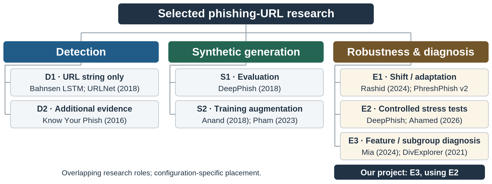

# Phishing URL Research: Literature Hierarchy

Jay · Part 2 · Milestone 2 · Three-page working section

## Scope and organizing perspective

We organize the selected literature by its principal research objective:
detection, synthetic URL generation, and robustness and diagnosis. This
is a map of contributions, not a mutually exclusive partition of whole
papers or an exhaustive history. A paper may span branches: generation
can change training data or supply evaluation examples, and a detector
study can also analyze behavior. Figure 1 uses one top-level perspective
and explicit second-level rules.

## Detection (D1–D2): what is available at prediction time?

D1 methods use the individual supplied URL string; D2 methods require
additional evidence such as webpage content, embedded URLs, a reference
list or URL resolution. Engineered and learned representations can occur
in either setting. Bahnsen’s character-level long short-term memory
network (LSTM) and URLNet illustrate D1 [[3](#ref3), [4](#ref4)];
Bahnsen’s Alexa-dependent random forest (RF) and Know Your Phish
illustrate D2 [[2](#ref2), [3](#ref3)]. Learned weights or
vocabularies are not additional observations. URLNet’s original
maliciousness task is broader than phishing.

## Generation (S1–S2): where do constructed examples enter?

S1 generates examples to examine an existing detector, as in DeepPhish
[[5](#ref5)]. S2 alters training through oversampling or completion,
as in Anand [[6](#ref6)] and Pham’s downstream experiment
[[8](#ref8)]. Retraining on generated data and testing a fixed
detector on generated data answer different questions. Learned
generation and rule-based URL mutation are also distinct mechanisms.

## Robustness and diagnosis (E1–E3): what is measured?

E1 covers source/time shifts and adaptation, distinguishing
untouched-target tests from access to unlabeled target data
[[9](#ref9), [12](#ref12)]. E2 evaluates specified generated or
modified inputs and identifies which error types change [[5](#ref5),
[15](#ref15)]. E3 examines feature contributions or property-defined
groups with different outcome rates [[16](#ref16), [17](#ref17)].
Models, representations, target-data access and evaluation protocols are
cross-cutting descriptors. Our project is primarily E3 in a
generated-input E2 setting, with detector and generator as supporting
components.

Figure 1. Selected contributions by objective, then information setting
or experimental role [[2](#ref2), [3](#ref3), [4](#ref4), [5](#ref5),
[6](#ref6), [8](#ref8), [9](#ref9), [12](#ref12), [15](#ref15),
[16](#ref16), [17](#ref17)]. This hierarchy is our synthesis. Branches
overlap; classification refers to the reviewed configuration, not every
component of a paper.

Scope. The map covers learning-based detection and the
generation/evaluation work relevant to URL diagnosis. It is not an
exhaustive taxonomy of blocklists, user education, email-only detection
or visual/interactive defences.

# Representative Literature Within the Hierarchy

Table 1. Mechanisms, experimental roles and evidence boundaries. The
interpretation column distinguishes what the reviewed work supports from
what our project would still need to test. Related papers share rows
only where the comparison remains explicit.

| **Study / role**                                                           | **Mechanism and experimental setting**                                                                                   | **Evidence boundary / project relevance**                                                                                                                    |
|----------------------------------------------------------------------------|--------------------------------------------------------------------------------------------------------------------------|--------------------------------------------------------------------------------------------------------------------------------------------------------------|
| **Verma–Dyer [[1](#ref1)] · D**                                          | Statistical-learning URL classification; historical background.                                                          | Record-only evidence. No detailed feature, robustness or diagnostic claims are adopted.                                                                      |
| **Bahnsen [[3](#ref3)]; URLNet [[4](#ref4)] · D1/D2**                  | Character LSTM versus engineered RF; URLNet combines character/word convolutional representations.                       | Bahnsen reports RF importance and uses an Alexa indicator in RF. URLNet’s malicious-URL evaluation is timestamp-ordered, not AI-specific.                    |
| **Know Your Phish [[2](#ref2)]; Kustiawan–Ghauth [[10](#ref10)] · D2** | URL/page relationships and separate target identification; URL/HTML/derived-feature comparisons across classifiers.      | Target identification can use search. Derived features do not inherently add a new information source; permutation importance is not subgroup diagnosis.     |
| **Sruthi–Naik [[11](#ref11)] · D/E2**                                    | Twin shared-weight LSTMs compare URL-pair representations; publisher excerpts describe conventional and generated tests. | Generated-evaluation precedent; precise input-role placement, pair construction, splits and full failure analysis remain unverified.                         |
| **DeepPhish [[5](#ref5)] · S1/E2**                                       | Actor-associated LSTM generation; an existing detector evaluates constructed examples.                                   | Already discusses structures, strategies and bypass. Our distinction is outcome-conditioned characterization with confirmation, not first property analysis. |
| **PhishHaven [[7](#ref7)] · D2/E2**                                      | URL expansion and lexical ensemble; conventional/DeepPhish-style evaluations.                                            | Includes property comparisons. Full pipeline is not fetch-free, and evaluated success is not a future-generator guarantee.                                   |
| **Anand [[6](#ref6)] · S2**                                              | Text-GAN oversampling adds generated minority-class URL strings to training.                                             | Abstract-level evidence. Exact regeneration of some test strings motivates an overlap audit, not a conclusion of leakage.                                    |
| **Pham [[8](#ref8)] · S2**                                               | GAN/DCGAN/WGAN/SeqGAN comparison; Section 4.3 retrains RF/LSTM with augmentation.                                        | Common-test-set training comparison, not frozen-detector testing. Training-mixture wording differs between Sections 3.1 and 4.3.                             |
| **Asiri–Alasmari [[13](#ref13)] · D2/S2**                                | Prefix-conditioned character completion; page classifier uses main and embedded URLs.                                    | Augmentation, incomplete-input tests and qualitative errors. Accepted manuscript has inconsistent numeric summaries; no headline gain is adopted.            |
| **Kim–Buu [[14](#ref14)] · S2**                                          | Phishing-rule graph/Graph RAG conditions LLM augmentation; validation and diversity are described.                       | SSRN abstract-level evidence. Five datasets do not by themselves establish cross-dataset transfer; no diagnostic-absence claim is made.                      |
| **Rashid [[9](#ref9)] · E1/E3**                                          | Cross-source errors, feature-distribution differences and unsupervised alignment.                                        | A direct explanatory precedent; target access differs from untouched-source testing. Publisher excerpts do not verify every method detail.                   |
| **PhreshPhish v2 [[12](#ref12)] · E1**                                   | URL/HTML observations, times and benchmarks with similarity and prevalence controls.                                     | An evaluation-quality contribution, not a diagnostic learner. Fix version/split; published controls do not replace a data audit.                             |
| **Ahamed [[15](#ref15)] · E2/E3**                                        | Four classifier families under rule-based mutations; deeper protocols use subsets.                                       | SHAP stability is LR-only. Some accuracy losses are false-positive cascades; label preservation is an assumption, not generated-data evidence.               |
| **Mia [[16](#ref16)] · E1/E3**                                           | Shared features, within-/cross-dataset comparisons and SHAP analysis.                                                    | Feature contributions vary by dataset. Attribution is neither causal proof nor the project’s proposed confirmation result.                                   |
| **DivExplorer [[17](#ref17)] · E3**                                      | Frequent property combinations; subgroup support and outcome-rate divergence.                                            | General classifier diagnosis, not phishing-specific. An adaptation must define outcomes and resolve overlapping rules into a single g.                       |

LR: logistic regression; GAN: generative adversarial network; LLM: large
language model. Access limits retained from the full draft:
[[1](#ref1)] publication record only; [[6](#ref6), [14](#ref14)]
abstracts; [[9](#ref9), [11](#ref11)] publisher excerpts. Other
entries summarize the relevant full-text-supported descriptions in that
draft. Access labels are not quality scores, and no missing analysis is
inferred from inaccessible material.

# Synthesis and Location of the Proposed Project

## What the comparison establishes

The progression is not “traditional methods versus AI.” Bahnsen and
URLNet [[3](#ref3), [4](#ref4)] vary representations, while Know Your
Phish and combined-feature studies [[2](#ref2), [10](#ref10)] expand
available evidence. DeepPhish and PhishHaven [[5](#ref5), [7](#ref7)]
already analyze generated-URL patterns; augmentation studies
[[6](#ref6), [8](#ref8), [13](#ref13), [14](#ref14)] instead alter
training. Rashid, Mia and Ahamed [[9](#ref9), [15](#ref15),
[16](#ref16)] examine feature shifts, attribution or scoped robustness.
DivExplorer [[17](#ref17)] adds explicit groups and outcome-rate
divergence. These precedents support a focused adaptation, not a claim
that earlier work never explains failures.

## Our proposed contribution and interpretation boundary

We primarily build on E3 diagnostic methods in an E2 generated-input
setting. For a detector f trained on recorded real-world URLs and held
fixed, define d(u) = 1 − f(u), with f(u) = 1 for flagged and d(u) = 1
for synthetic non-detection. An interpretable g learns relationships
between URL information and these outcomes; g is not simply the directly
observed target or a replacement phishing detector. A pattern-mining
adaptation must define conflicts, uncovered cases and prediction
thresholds before it implements one binary g.

Each reported characterization will specify a URL-property condition,
its covered observations, coverage, non-detection frequency, comparison
baseline and uncertainty. Discovery and confirmation are separate;
failures to replicate are reportable, and related generation families
should be kept together where available. Intended-positive annotations
do not verify operational phishing, nor do associations establish
causes. Arp et al. [[18](#ref18)] motivate leakage and evaluation
safeguards. No generator, diagnostic algorithm, stable pattern or
detection-accuracy improvement is promised by this literature map.

Evidence status. This is a condensation of the supplied source-grounded
draft, not a new systematic search. Partial-access limits remain
explicit on page 2. Preprints and accepted manuscripts are labeled
below; code, experiments and complete datasets were not independently
reproduced.

## References

[1] R. Verma and K. Dyer. 2015.
[On the Character of Phishing URLs: Accurate and Robust Statistical
Learning Classifiers.](https://doi.org/10.1145/2699026.2699115) ACM
CODASPY, 111–122.

[2] S. Marchal et al. 2016.
[Know Your Phish: Novel Techniques for Detecting Phishing Sites and
Their Targets.](https://doi.org/10.1109/ICDCS.2016.10) IEEE ICDCS,
323–333.

[3] A. Correa Bahnsen et al.
2017. [Classifying Phishing URLs Using Recurrent Neural
Networks.](https://doi.org/10.1109/ECRIME.2017.7945048) APWG eCrime,
1–8.

[4] H. Le et al. 2018. [URLNet:
Learning a URL Representation with Deep Learning for Malicious URL
Detection.](https://doi.org/10.48550/arXiv.1802.03162) arXiv:1802.03162
(preprint).

[5] A. Correa Bahnsen et al.
2018. [DeepPhish: Simulating Malicious
AI.](https://albahnsen.wordpress.com/wp-content/uploads/2018/05/deepphish-simulating-malicious-ai_submitted.pdf)
Author-hosted manuscript.

[6] A. Anand et al. 2018.
[Phishing URL Detection with Oversampling Based on Text Generative
Adversarial Networks.](https://doi.org/10.1109/BigData.2018.8622547)
IEEE Big Data, 1168–1177.

[7] M. Sameen, K. Han and S. O.
Hwang. 2020. [PhishHaven—An Efficient Real-Time AI Phishing URLs
Detection System.](https://doi.org/10.1109/ACCESS.2020.2991403) IEEE
Access 8, 83425–83443.

[8] T. T. T. Pham, T. D. Pham
and V. C. Ta. 2023. [Evaluation of GAN-based Models for Phishing URL
Classifiers.](https://doi.org/10.5815/ijcnis.2023.02.01) IJCNIS 15(2),
1–14.

[9] F. Rashid et al. 2024.
[Phishing URL Detection Generalisation Using Unsupervised Domain
Adaptation.](https://doi.org/10.1016/j.comnet.2024.110398) Computer
Networks 245, 110398.

[10] Y. A. Kustiawan and K. I.
Ghauth. 2025. [Evaluating the Impact of Feature Engineering in Phishing
URL Detection: A Comparative Study of URL, HTML, and Derived
Features.](https://doi.org/10.1109/ACCESS.2025.3579223) IEEE Access 13,
126756–126768.

[11] Sruthi K and Manohar Naik
S. 2025. [A Novel Framework for Effective Phishing URL Detection Using
an LSTM-based Siamese
Network.](https://doi.org/10.1016/j.knosys.2025.114271) Knowledge-Based
Systems 329(A), 114271.

[12] T. Dalton et al. 2025; v2,
11 February 2026. [PhreshPhish: A Real-World, High-Quality, Large-Scale
Phishing Website Dataset and
Benchmark.](https://doi.org/10.48550/arXiv.2507.10854) arXiv:2507.10854
(preprint).

[13] S. Asiri and N. Alasmari.
2026. [Phishing Webpage Detection Using Structured URL
Generation.](https://doi.org/10.1038/s41598-026-63981-3) Scientific
Reports; accepted manuscript, 27 July 2026.

[14] M.-J. Kim and S.-J. Buu.
2026. [Knowledge-Grounded LLM-Driven Augmentation via Graph RAG for
Phishing URL Detection.](https://doi.org/10.2139/ssrn.6749439) SSRN
6749439 (preprint).

[15] T. Ahamed et al. 2026. [An
Integrated Evaluation Protocol for Adversarial Robustness,
Generalization, and Explanation Stability in URL-Based Phishing
Detection.](https://doi.org/10.3389/fcomp.2026.1834407) Frontiers in
Computer Science 8, 1834407.

[16] M. Mia, D. Derakhshan and
M. M. A. Pritom. 2024. [Can Features for Phishing URL Detection Be
Trusted Across Diverse Datasets? A Case Study with Explainable
AI.](https://doi.org/10.1145/3704522.3704532) NSysS 2024.

[17] E. Pastor, L. de Alfaro
and E. Baralis. 2021. [Looking for Trouble: Analyzing Classifier
Behavior via Pattern
Divergence.](https://doi.org/10.1145/3448016.3457284) ACM SIGMOD.

[18] D. Arp et al. 2022. [Dos
and Don’ts of Machine Learning in Computer
Security.](https://www.usenix.org/conference/usenixsecurity22/presentation/arp)
USENIX Security, 3971–3988.
