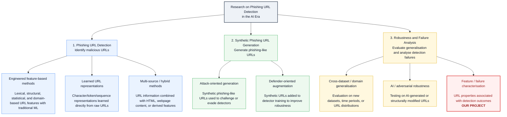

# Phishing URL Research Hierarchy and Comparative Literature Map

**CSC503 / SENG747 - Milestone 2 Planning Document**

**Current project focus.** Characterize URL properties associated with non-detection of AI-generated phishing-like URLs by a fixed phishing classifier trained on real-world data. The generalisation issue provides context; the main analytical focus is the URL characteristics associated with detector outcomes.

**How to use this document.** The hierarchy maps the literature by research objective. The comparison matrix then contrasts representative papers across data, methods, robustness evaluation, feature/failure analysis, and relevance to your project. The reference numbers match the bibliography at the end.

# 1. Recommended Literature Hierarchy

**Level 1 perspective - research objective.** Existing work can be organized into three broad objectives: (1) phishing URL detection, (2) synthetic phishing URL generation, and (3) robustness and failure analysis. Within each branch, Level 2 groups approaches by the way that objective is addressed. The hierarchy is visualized in Figure 1, while representative papers for each branch are listed in the literature map below.

*Figure 1. Proposed hierarchy of existing work in phishing URL detection. The project is positioned under feature/failure characterisation within robustness and failure analysis.*

**Literature landscape.** Existing work on phishing URL detection spans three broad research objectives: detection, synthetic URL generation, and robustness/failure analysis. Detection methods range from traditional approaches based on engineered lexical, structural, and domain-related URL features [1,10] to neural models that learn representations directly from raw URL character or token sequences [3,4]; some methods also incorporate webpage or HTML information [2,10]. Synthetic URL generation includes attack-oriented work that creates phishing-like URLs to challenge or evade detectors [5,8] and defender-oriented augmentation that adds generated examples to detector training [6,13,14]. Robustness research evaluates whether detectors remain reliable under cross-dataset, temporal, AI-generated, or adversarial shifts [7,9,11,12,15].

Within this landscape, our project is positioned under **feature/failure characterization**. Rather than developing another phishing detector or only measuring whether performance decreases, it investigates which URL properties are associated with AI-generated phishing-like URLs not being flagged by a fixed classifier.

# 2. Hierarchy Map With Representative Literature

| **Level 1 category**          | **Level 2 subcategory**               | **Representative papers**                                                          | **What the branch studies / why it matters**                                                                                                |
|-------------------------------|---------------------------------------|------------------------------------------------------------------------------------|---------------------------------------------------------------------------------------------------------------------------------------------|
| Detection                     | Engineered feature-based methods      | Verma & Dyer (2015) [1]; Kustiawan & Ghauth (2025) [10]                        | Uses lexical, structural, domain and derived URL features with conventional ML. Useful as interpretable baselines.                          |
| Detection                     | Learned URL representations           | Bahnsen et al. (2017) [3]; URLNet (2018) [4]; Sruthi & Naik (2025) [11]      | Learns character/token representations directly from raw URLs, reducing reliance on manual feature engineering.                             |
| Detection                     | Multi-source / hybrid methods         | Marchal et al. (2016) [2]; Kustiawan & Ghauth (2025) [10]                      | Combines URL information with webpage/HTML content or derived information. Broader than the scope of the current URL-only project.          |
| Synthetic URL Generation      | Attack-oriented generation            | DeepPhish (2018) [5]; Pham et al. (2023) [8]                                   | Generates phishing-like URLs to challenge or evade detectors; motivates evaluation on AI-generated examples.                                |
| Synthetic URL Generation      | Defender-oriented augmentation        | Anand et al. (2018) [6]; Asiri & Alasmari (2026) [13]; Kim & Buu (2026) [14] | Generates synthetic phishing examples to augment training and improve detection robustness.                                                 |
| Robustness & Failure Analysis | Cross-dataset / domain generalisation | Rashid et al. (2024) [9]; PhreshPhish (2025) [12]                              | Evaluates whether high in-dataset performance transfers to new datasets, time periods, or realistic benchmarks.                             |
| Robustness & Failure Analysis | AI / adversarial robustness           | PhishHaven (2020) [7]; Sruthi & Naik (2025) [11]; Ahamed et al. (2026) [15]  | Tests detectors under AI-generated or structurally modified URL patterns and measures degradation.                                          |
| Robustness & Failure Analysis | Feature / failure characterisation    | **Rashid et al. (2024) [9]; Ahamed et al. (2026) [15]; OUR PROJECT**           | **Analyzes which URL properties or explanation patterns are associated with detector outcomes. This is the closest branch to the project.** |

# 3. Comparative Literature Matrix

Use this table to decide which representative works should appear in the final two-page review. It intentionally compares approaches rather than summarizing papers in discovery order.

| **Category**                | **Work**                                  | **Approach / model**                                                              | **Information used**                                        | **AI / synthetic URLs**                         | **Robustness / generalisation**                                                    | **Feature / failure analysis**                                                        | **Key limitation and relevance to our project**                                                                                                                              |
|-----------------------------|-------------------------------------------|-----------------------------------------------------------------------------------|-------------------------------------------------------------|-------------------------------------------------|------------------------------------------------------------------------------------|---------------------------------------------------------------------------------------|------------------------------------------------------------------------------------------------------------------------------------------------------------------------------|
| Detection                   | Verma & Dyer (2015) [1]                 | Statistical URL features + ML classifiers                                         | Lexical, structural, domain/statistical URL features        | No                                              | Limited; primarily conventional evaluation                                         | Feature importance / engineered features                                              | Interpretable classical baseline, but manually designed features may not capture novel construction patterns.                                                                |
| Detection                   | Marchal et al. (2016) [2]               | Webpage / key-term based phishing detection                                       | URL plus webpage content and key terms                      | No                                              | Targets new phishing targets rather than AI shift                                  | Some information-source analysis                                                      | Shows value of webpage information, but it is broader than this project's URL-only scope.                                                                                    |
| Detection                   | Bahnsen et al. (2017) [3]               | Recurrent neural network                                                          | Raw URL character sequence                                  | No                                              | Generalisation beyond handcrafted features, but not AI-specific                    | No dedicated failure-characterisation analysis                                        | Useful learned-representation baseline; avoids manual feature creation.                                                                                                      |
| Detection                   | Le et al. - URLNet (2018) [4]           | Character + word CNN                                                              | Raw URL characters and words                                | No                                              | Designed to handle unseen features better than manual feature pipelines            | Ablation, not false-negative characterization                                         | Strong end-to-end representation-learning baseline, but less interpretable.                                                                                                  |
| Generation / Evasion        | Bahnsen et al. - DeepPhish (2018) [5]   | LSTM phishing URL generator                                                       | Real phishing URLs from specific threat actors              | Yes - attack-oriented generation                | Tests whether generated URLs evade an existing detector                            | Threat-actor pattern analysis; limited detector failure characterization              | Directly motivates the project: generated URLs can bypass existing detection, but does not systematically characterize false-negative URL properties.                        |
| Generation / Augmentation   | Anand et al. (2018) [6]                 | Text-GAN oversampling                                                             | Generated phishing URL strings for training                 | Yes - defensive augmentation                    | Focuses on class imbalance rather than external generalisation                     | Limited                                                                               | Shows synthetic URL generation can help training; also highlights memorisation / leakage concerns.                                                                           |
| Robustness                  | Sameen et al. - PhishHaven (2020) [7]   | Ensemble ML + lexical features                                                    | Human-crafted and AI-generated phishing URLs                | Yes                                             | Direct human-vs-AI phishing evaluation                                             | Limited feature-failure analysis                                                      | Highly relevant evidence that AI-generated phishing needs explicit robustness evaluation; less focused on explaining non-detection.                                          |
| Generation / Evaluation     | Pham et al. (2023) [8]                  | GAN, DCGAN, WGAN, SeqGAN                                                          | URL character sequences                                     | Yes                                             | Tests generated URLs against phishing classifiers                                  | Structural similarity / model comparison                                              | Useful for comparing generators, but the central question is not which characteristics distinguish detected from non-detected AI URLs.                                       |
| Generalisation              | Rashid et al. (2024) [9]                | Multiple detectors + unsupervised domain adaptation                               | URL lexical/structural features across datasets             | No AI generator                                 | Strong cross-dataset evaluation; reports 10-32% performance drops                  | Yes - statistically identifies shifted features linked to transfer failure            | Closest methodological inspiration: performance shift → analyze feature distributions → interpret which characteristics are associated with failure.                     |
| Detection / Features        | Kustiawan & Ghauth (2025) [10]          | Comparative feature engineering across ML models                                  | URL, HTML and derived features                              | No                                              | Multiple models; not primarily AI robustness                                       | Yes - compares feature groups                                                         | Useful for defining candidate URL characteristics and demonstrating why information-source choice matters.                                                                   |
| AI robustness               | Sruthi & Naik (2025) [11]               | Siamese LSTM                                                                      | URL sequence embeddings / pairwise similarity               | Yes - dedicated AI-generated test examples      | Direct evaluation on traditional and AI-generated phishing URLs                    | Attack categories, but not systematic non-detection feature analysis                  | Shows human-to-AI generalisation is already being studied; supports shifting novelty toward analyzing why examples are missed.                                               |
| Benchmark / Generalisation  | Dalton et al. - PhreshPhish (2025) [12] | Dataset + realistic benchmark suite                                               | URL + HTML pairs with realistic splits                      | No generator                                    | Strong focus on leakage, realistic base rates and temporal consistency             | Not primarily feature-failure analysis                                                | Important evaluation reference for avoiding optimistic results and leakage.                                                                                                  |
| Generation / Augmentation   | Asiri & Alasmari (2026) [13]            | Prefix-conditioned character-level URL generator                                  | URL strings / embedded URLs from webpages                   | Yes - defensive augmentation                    | Tests augmentation on unknown data conditions                                      | Limited failure characterization                                                      | Modern evidence that learned URL generation can improve detector training; not focused on characterizing AI-generated false negatives.                                       |
| Generation / Augmentation   | Kim & Buu (2026) [14]                   | LLM + phishing-rule knowledge graph + Graph RAG                                   | Knowledge-grounded synthetic URL generation                 | Yes - LLM augmentation                          | Motivated by distribution shift                                                    | Validation and diversity, but not the same non-detection analysis                     | Shows LLM generation alone is no longer novel; currently a preprint, so treat as recent related work.                                                                        |
| Robustness / Explainability | Ahamed et al. (2026) [15]               | LR, XGBoost, CharCNN, BERT + structured perturbations                             | URL lexical/structural features and raw URL representations | Adversarially modified URLs                     | Strong: adversarial robustness, unseen attack-family transfer, external validation | Yes - SHAP explanation stability                                                      | Very relevant comparison: links URL perturbations, robustness loss and explanation changes, but does not exactly study non-detection within AI-generated phishing-like URLs. |
| **Our project**             | Current study                             | Fixed detector + interpretable non-detection model / statistical characterization | URL-derived lexical and structural properties               | Yes - AI-generated phishing-like test URLs only | AI-generated evaluation set excluded from detector training                        | Main focus: characteristics associated with flagged vs non-flagged generated examples | **Contribution is diagnostic/associational, not a new phishing detector and not a causal claim.**                                                                            |

# 4. Recommended Positioning of the Project

- **What is already established:** Phishing detection methods span hand-crafted features, learned URL representations, and multi-source webpage methods. AI-generated or adversarially modified phishing URLs are already being evaluated in the literature \[7, 11, 15\].

- **What should not be claimed as the main novelty:** Do not claim that testing a human-trained detector on AI-generated phishing URLs is itself new. Human-vs-AI or adversarial robustness is already an active research direction.

- **Most defensible focus:** Use the generalisation problem as context, but make the main focus the characteristics that distinguish AI-generated phishing-like URLs that are flagged from those that are not flagged by the fixed classifier.

- **Closest methodological precedent:** Rashid et al. [9] is especially useful because it moves from performance degradation to statistical analysis of shifted URL features. Ahamed et al. [15] is useful because it connects URL perturbations, robustness degradation and explanation stability across model families.

- **Project wording:** A concise positioning statement is: Existing work has shown that phishing URL detectors can degrade under distribution shift and AI/adversarial URL patterns; this project focuses on characterizing the URL properties associated specifically with non-detection among AI-generated phishing-like examples.

# 5. Suggested Reading Priority

1.  **Rashid et al. (2024) [9] -** Best methodological match for generalisation + feature-shift analysis.

2.  **Ahamed et al. (2026) [15] -** Best recent comparison for robustness + explanation/failure analysis across model families.

3.  **Sruthi & Naik (2025) [11] -** Directly shows that evaluation on AI-generated phishing URLs is already being done.

4.  **DeepPhish (2018) [5] -** Foundational motivation for generated phishing URLs that evade existing detection.

5.  **PhishHaven (2020) [7] -** Early direct attempt to detect both human-crafted and AI-generated phishing URLs.

6.  **Kustiawan & Ghauth (2025) [10] -** Useful for defining URL/HTML/derived feature categories and candidate characteristics.

7.  **PhreshPhish (2025) [12] -** Useful for realistic benchmark design, leakage concerns and modern data.

8.  **Pham et al. (2023) [8] -** Useful for understanding variation across generative URL models.

# 6. References

[1] R. Verma and K. Dyer. 2015. On the Character of Phishing URLs: Accurate and Robust Statistical Learning Classifiers. In Proceedings of the 5th ACM Conference on Data and Application Security and Privacy (CODASPY 2015).

[2] S. Marchal, K. Saari, N. Singh, and N. Asokan. 2016. Know Your Phish: Novel Techniques for Detecting Phishing Sites and Their Targets. In 36th IEEE International Conference on Distributed Computing Systems (ICDCS), 323-333.

[3] A. C. Bahnsen, E. C. Bohorquez, S. Villegas, J. Vargas, and F. A. Gonzalez. 2017. Classifying Phishing URLs Using Recurrent Neural Networks. In APWG Symposium on Electronic Crime Research (eCrime), 1-8.

[4] H. Le, Q. Pham, D. Sahoo, and S. C. H. Hoi. 2018. URLNet: Learning a URL Representation with Deep Learning for Malicious URL Detection. arXiv:1802.03162.

[5] A. C. Bahnsen, I. Torroledo, L. D. Camacho, and S. Villegas. 2018. DeepPhish: Simulating Malicious AI. Author-hosted manuscript.

[6] A. Anand, K. Gorde, J. R. A. Moniz, N. Park, T. Chakraborty, and B. T. Chu. 2018. Phishing URL Detection with Oversampling Based on Text Generative Adversarial Networks. In IEEE International Conference on Big Data.

[7] M. Sameen, K. Han, and S. O. Hwang. 2020. PhishHaven - An Efficient Real-Time AI Phishing URLs Detection System. IEEE Access 8, 83425-83443.

[8] T. T. T. Pham, T. D. Pham, and V. C. Ta. 2023. Evaluation of GAN-based Models for Phishing URL Classifiers. International Journal of Computer Network and Information Security 15(2), 1-14.

[9] F. Rashid, B. Doyle, S. C. Han, and S. Seneviratne. 2024. Phishing URL Detection Generalisation Using Unsupervised Domain Adaptation. Computer Networks 245, 110398.

[10] Y. A. Kustiawan and K. I. Ghauth. 2025. Evaluating the Impact of Feature Engineering in Phishing URL Detection: A Comparative Study of URL, HTML, and Derived Features. IEEE Access 13, 126756-126768.

[11] K. Sruthi and S. Manohar Naik. 2025. A Novel Framework for Effective Phishing URL Detection Using an LSTM-based Siamese Network. Knowledge-Based Systems 329(A), 114271.

[12] T. Dalton, H. Gowda, G. Rao, S. Pargi, A. Hadj Khodabakhshi, J. Rombs, S. Jou, and M. Marwah. 2025. PhreshPhish: A Real-World, High-Quality, Large-Scale Phishing Website Dataset and Benchmark. arXiv:2507.10854.

[13] S. Asiri and N. Alasmari. 2026. Phishing Webpage Detection Using Structured URL Generation. Scientific Reports.

[14] M.-J. Kim and S.-J. Buu. 2026. Knowledge-Grounded LLM-Driven Augmentation via Graph RAG for Phishing URL Detection. SSRN preprint.

[15] T. Ahamed, S. C. Kakon, F. A. Farid, J. Uddin, and H. B. A. Karim. 2026. An Integrated Evaluation Protocol for Adversarial Robustness, Generalization, and Explanation Stability in URL-Based Phishing Detection. Frontiers in Computer Science 8:1834407.
